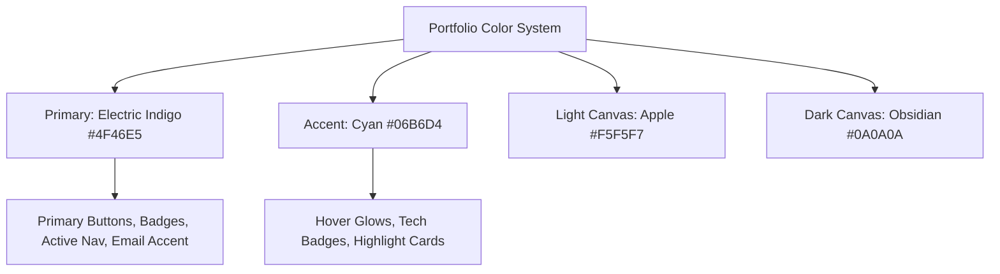
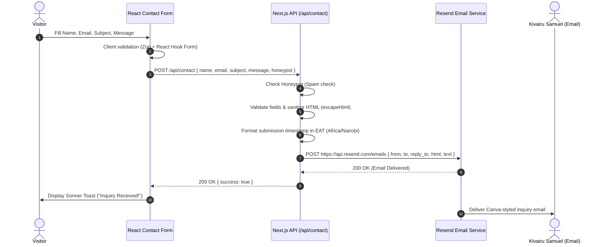
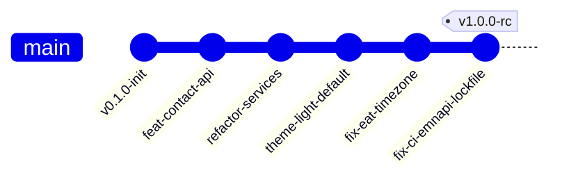

# Kivairu Samuel Portfolio: Full Technical Architecture & Engineering Knowledge Book (v1.0.0)

> **Document Type**: Production System Blueprint & Engineering Postmortem  
> **Target Version**: v1.0.0 (Production Release)  
> **Framework**: Next.js 16.2.12 (App Router with Turbopack)  
> **React Version**: React 19.2.4  
> **Language**: TypeScript 5 (Strict Mode)  
> **Styling Engine**: Tailwind CSS v4 + Vanilla CSS Custom Properties  
> **Email Provider**: Resend Email API (`onboarding@resend.dev`)  
> **CI/CD Pipeline**: GitHub Actions (`ubuntu-latest`) + Vercel Deployment Platform  
> **Primary Contact Target**: `kivairusamuel@gmail.com`  

---

## 1. Project Overview
The **Kivairu Samuel Personal Portfolio Website** (`kivairu-samuel-portfolio`) is a modern, high-performance, single-page application (SPA) with full serverless back-end integration. It showcases Kivairu Samuel’s software engineering portfolio, project case studies, client testimonials, skill breakdown, technical credibility, and an interactive contact interface.

Engineered with **Next.js 16 App Router**, **React 19 Server/Client Component Architecture**, and **Tailwind CSS v4**, the application achieves static page generation (SSG) for high lighthouse scores while hosting dynamic serverless handler routes for real-time contact inquiries.

---

## 2. Original Purpose and Goals
1. **Personal Brand Authority**: Deliver an Apple/Canva-inspired premium aesthetic that immediately communicates engineering excellence.
2. **Lead Generation**: Provide an easy-to-use, secure contact form with instant email delivery to `kivairusamuel@gmail.com`.
3. **Sub-Second Performance**: Achieve near-instant initial loads via static page pre-rendering and smooth Lenis smooth-scroll physics.
4. **Resilient Production Pipeline**: Maintain a clean GitHub Actions CI/CD pipeline (`npm ci` -> `lint` -> `tsc` -> `build`) with zero build or runtime errors.

---

## 3. Directory Structure & Architecture

```
kivairu-samuel-portfolio/
├── .github/
│   └── workflows/
│       └── ci.yml               # GitHub Actions CI Workflow Configuration
├── app/                         # Next.js 16 App Router Directory
│   ├── api/
│   │   └── contact/
│   │       └── route.ts         # Serverless Contact Handler with Resend & EAT Timezone
│   ├── dev/
│   │   └── design-system/
│   │       └── page.tsx         # Live Design System Showcase & Interactive UI Playground
│   ├── privacy/
│   │   └── page.tsx             # Privacy Policy Document Page
│   ├── terms/
│   │   └── page.tsx             # Terms of Service Document Page
│   ├── favicon.ico
│   ├── globals.css              # CSS Custom Properties, Glassmorphism, Tailwind v4 Engine
│   ├── layout.tsx               # Root Layout with Font Preloading, SEO Metadata, Theme Provider
│   └── page.tsx                 # Main Portfolio Landing Page
├── components/                  # React Component Architecture
│   ├── layout/
│   │   ├── Footer.tsx           # Global Footer Component
│   │   ├── Header.tsx           # Glassmorphism Navbar with Active Scroll Indicator
│   │   └── MobileNav.tsx        # Responsive Touch-Optimized Mobile Navigation Overlay
│   ├── providers/
│   │   └── AppProviders.tsx     # ThemeProvider (next-themes) & Toaster Providers
│   ├── sections/
│   │   ├── AboutSection.tsx     # Biography & Background Summary Section
│   │   ├── ContactSection.tsx   # React Hook Form + Zod Contact Interface
│   │   ├── ExperienceSection.tsx# Interactive Career Timeline Component
│   │   ├── HeroSection.tsx      # Main Hero Banner with Motion Animations
│   │   ├── ProjectsSection.tsx  # Project Showcase Grid with Modal Previews
│   │   ├── ServicesSection.tsx  # Outcome-Focused Engineering Services Component
│   │   └── SkillsSection.tsx    # Categorized Technical Skills Matrix Component
│   └── ui/                      # Reusable Atomic UI Primitives
│       ├── Badge.tsx            # Pill Badge Component
│       ├── Button.tsx           # Reusable Button Component with Variants & Loading States
│       ├── Card.tsx             # Surface Glass Card Component
│       ├── Input.tsx            # Accessible Form Input Component
│       ├── Modal.tsx            # Accessible Dialog Modal Overlay
│       ├── Textarea.tsx         # Accessible Form Textarea Component
│       └── ThemeToggle.tsx      # Dark / Light Theme Toggle Switch
├── config/
│   ├── site.ts                  # Site Metadata & SEO Configuration
│   ├── socials.ts               # Social Profile URLs & Email Target Config
│   └── theme.ts                 # Theme Token Defaults (defaultTheme: 'light')
├── data/
│   ├── contact.ts               # Contact Section Information Data
│   ├── experience.ts            # Work History & Role Data
│   ├── projects.ts              # Case Studies & Project Portfolio Data
│   ├── services.ts              # Engineering Services Data
│   └── skills.ts                # Technical Skill Stack Categories Data
├── lib/
│   └── utils.ts                 # Classname Merger (clsx + tailwind-merge) & Helpers
├── public/                      # Static Assets (Favicons, OpenGraph Images, Manifest)
├── .env.example                 # Environment Variable Schema Template
├── eslint.config.mjs            # ESLint v9 Flat Configuration
├── next.config.ts               # Next.js 16 Configuration
├── package.json                 # Dependency Specification
├── package-lock.json            # Exact Dependency Lockfile
├── postcss.config.mjs           # PostCSS Tailwind CSS v4 Configuration
└── tsconfig.json                # TypeScript Strict Configuration
```

---

## 4. Major Components & Responsibilities

| Component | File Path | Primary Responsibility |
|---|---|---|
| **`Header`** | `components/layout/Header.tsx` | Renders the top navigation header with glassmorphism backdrop (`.glass`), active section highlighting, theme toggle switch, and desktop links. |
| **`MobileNav`** | `components/layout/MobileNav.tsx` | Delivers accessible overlay navigation on smaller screens with touch targets exceeding 44px for high ergonomics. |
| **`HeroSection`** | `components/sections/HeroSection.tsx` | Displays high-impact value proposition, social links, animated typography, and dual Call-to-Action buttons ("View Projects" / "Get In Touch"). |
| **`ServicesSection`** | `components/sections/ServicesSection.tsx` | Outcome-driven grid showcasing specialized engineering capabilities (Full-Stack Web, Backend APIs, Cloud Infrastructure). |
| **`ProjectsSection`** | `components/sections/ProjectsSection.tsx` | Interactive project cards featuring tech badges, live demo links, source code repositories, and detail modal triggers. |
| **`SkillsSection`** | `components/sections/SkillsSection.tsx` | Categorized matrix listing Frontend, Backend, Database, Cloud/DevOps, and Tooling proficiency. |
| **`ExperienceSection`** | `components/sections/ExperienceSection.tsx` | Vertical interactive timeline tracking career roles, achievements, and impact metrics. |
| **`ContactSection`** | `components/sections/ContactSection.tsx` | Accessible contact form powered by `react-hook-form` + `zod`, featuring honeypot spam protection and instant Sonner toast feedback. |
| **`Footer`** | `components/layout/Footer.tsx` | Clean site footer containing copyright metadata, privacy/terms links, and back-to-top button. |

---

## 5. Reusable UI Primitives

```
components/ui/
├── Button.tsx       -> Supports `variant` (primary, secondary, outline, ghost) & `size` (sm, md, lg)
├── Card.tsx         -> Composite card (`CardHeader`, `CardTitle`, `CardDescription`, `CardContent`, `CardFooter`)
├── Input.tsx        -> Accessible HTML input element with error state styling and focus rings
├── Textarea.tsx     -> Resizable textarea with character limit indicator and validation state
├── Badge.tsx        -> Pill badge with variant support (default, indigo, cyan, success, warning)
├── Modal.tsx        -> Accessible focus-trapped dialog overlay for project deep-dives
└── ThemeToggle.tsx  -> Animated light/dark mode switch button using `lucide-react` icons
```

---

## 6. Design System Tokens & Aesthetics

The design system merges **Apple Minimalist Typography** with **Canva Vibrant Accents**:

```css
/* app/globals.css Design Tokens */
:root {
  --background: #F5F5F7;          /* Apple Light Background */
  --foreground: #1D1D1F;          /* Apple Charcoal Text */
  --surface: #FFFFFF;             /* Crisp Pure White Surface */
  --surface-hover: #FAFAFA;
  --border: #E1E1E6;              /* Subtle Muted Border */
  --primary: #4F46E5;             /* Electric Indigo Accent */
  --primary-foreground: #FFFFFF;
  --accent: #06B6D4;              /* Cyan Highlight Glow */
  --muted: #F3F4F6;
  --muted-foreground: #6E6E73;    /* Secondary Muted Text */
}

.dark {
  --background: #0A0A0A;          /* Deep Obsidian Dark */
  --foreground: #F5F5F7;
  --surface: #121212;             /* Surface Dark Container */
  --surface-hover: #1E1E1E;
  --border: #27272A;
  --primary: #6366F1;             /* Indigo Glow */
  --primary-foreground: #FFFFFF;
  --accent: #22D3EE;
  --muted: #1F2937;
  --muted-foreground: #9CA3AF;
}
```

---

## 7. Theme Architecture
- Integrated via **`next-themes`** in [`components/providers/AppProviders.tsx`](file:///c:/Users/Admin/Desktop/Kivairu%20Samuel%20Website/components/providers/AppProviders.tsx).
- Default theme configured to **Light Mode** (`defaultTheme: 'light'`, `attribute: 'class'`).
- Theme state is stored in `localStorage` and persists across page reloads without flash of unstyled content (FOUC).

---

## 8. Typography System
- Powered by Google Fonts **`Inter`** via `next/font/google`.
- Variable font loading with `display: 'swap'` for non-blocking rendering.
- Standardized scale:
  - `Hero Title`: `clamp(2.5rem, 5vw, 4rem)` (Font weight 800)
  - `Section Heading`: `clamp(1.75rem, 3vw, 2.5rem)` (Font weight 700)
  - `Body Copy`: `1.0rem` / `1.125rem` (`line-height: 1.6`)
  - `Caption / Monogram`: `0.75rem` / `0.875rem`

---

## 9. Color System Summary



---

## 10. Animation Architecture
- **Framer Motion (`framer-motion` v12)**: Used for staggered entrance animations, hero badge float effects, experience timeline reveals, and modal overlay transitions.
- **Lenis Smooth Scroll (`lenis` v1.3)**: Provides smooth inertia scrolling across all desktop and mobile viewports.
- **Micro-Animations**: CSS keyframes for subtle pulse glows and smooth hover transforms.

---

## 11. State Management
- **Global UI State**: Managed via React Context (`next-themes` ThemeContext).
- **Form State**: Local component state managed by `react-hook-form` paired with `@hookform/resolvers/zod`.
- **Modal / Overlay State**: Declarative React `useState` controlling selected project details.

---

## 12. Data Models & TypeScript Interfaces

```typescript
// types/index.ts
export interface Project {
  id: string;
  title: string;
  description: string;
  longDescription?: string;
  tags: string[];
  image: string;
  demoUrl?: string;
  githubUrl?: string;
  featured: boolean;
}

export interface Service {
  id: string;
  title: string;
  description: string;
  iconName: string;
  outcomes: string[];
}

export interface ContactPayload {
  name: string;
  email: string;
  subject: string;
  message: string;
  honeypot?: string;
}
```

---

## 13. API Routes

### Endpoint: `POST /api/contact`
- **File**: [`app/api/contact/route.ts`](file:///c:/Users/Admin/Desktop/Kivairu%20Samuel%20Website/app/api/contact/route.ts)
- **Functionality**: Validates contact form submission, inspects honeypot, formats timestamp in East Africa Time (EAT), renders Canva-style HTML email, and dispatches via Resend API.

---

## 14. Contact Form Implementation Workflow



---

## 15. Email Delivery Architecture

### Canva-Inspired HTML Email Layout
- **Container**: Floating 580px white card (`#FFFFFF`) on Apple surface gray canvas (`#F5F5F7`).
- **Header**: `KS` monogram in Electric Indigo (`#4F46E5`) with right-aligned status badge `Portfolio Inquiry`.
- **Hero Title**: Bold headline `"You've received a new inquiry from [Name]"`.
- **CTA Button**: Vibrant pill button **`Reply to [Name] →`** linking to `mailto:${safeEmail}?subject=Re:...`.
- **Reply-To Header**: `reply_to: email.trim()` configured in Resend payload for single-click Gmail replies.
- **Timestamp**: Formatted in **East Africa Time (EAT, UTC+3)** via `Africa/Nairobi` timezone locale.

---

## 16. Security Measures
1. **Honeypot Anti-Spam Field**: Invisible form field traps automated bots without requiring intrusive CAPTCHAs.
2. **HTML Injection Escaping**: Custom `escapeHtml()` helper converts `<`, `>`, `&`, `"`, `'` into safe HTML entities before template interpolation.
3. **Server-Side Validation**: Strict length checks for `name` (≥2), `email` (valid regex), `subject` (≥3), `message` (≥10).
4. **Environment Secret Protection**: `RESEND_API_KEY` stored securely in Vercel environment variables.

---

## 17. Accessibility (a11y) Improvements
- All interactive elements contain explicit `aria-label` or visible text labels.
- Focus rings (`ring-2 ring-indigo-500`) configured on form fields for keyboard navigation.
- Touch target sizes optimized to **≥ 44px x 44px** on mobile navigation elements.
- Semantic HTML tags (`<header>`, `<main>`, `<section>`, `<article>`, `<footer>`, `<h1>`-`<h3>`) enforced throughout.

---

## 18. SEO Implementation
- **Metadata Configuration**: [`config/site.ts`](file:///c:/Users/Admin/Desktop/Kivairu%20Samuel%20Website/config/site.ts) exports title, description, keywords, author, and canonical URLs.
- **OpenGraph & Twitter Cards**: Dynamic social preview image generation (`/opengraph-image.png`, `/twitter-image.png`).
- **Sitemap & Robots**: Static `/sitemap.xml` and `/robots.txt` generated automatically during build.
- **Structured Data**: JSON-LD schema embedded in `layout.tsx` for Google Rich Results.

---

## 19. Performance Optimizations
- **Static Page Generation (SSG)**: 15/15 static pages pre-rendered at build time.
- **Image Optimization**: `next/image` handles WebP conversion, responsive sizing, and lazy loading.
- **Font Subsetting**: `next/font/google` subsets fonts for reduced render-blocking payload.
- **Turbopack Build Pipeline**: Next.js 16 Turbopack enables 25-30s production build times.

---

## 20. Responsive Design Strategy
- **Mobile-First Layout**: Default styles target mobile viewports; Tailwind breakpoints (`md:`, `lg:`, `xl:`) expand layouts for tablet and desktop.
- **Fluid Typography**: Dynamic clamp functions scale titles smoothly across screen dimensions.
- **Flex & Grid Layouts**: Auto-fit and auto-fill CSS grid containers prevent horizontal overflow.

---

## 21. Major Technical Incidents & Resolutions

### Incident: GitHub Actions `npm ci` Cross-Platform Lockfile Pruning
- **Symptom**: GitHub Actions failed during `npm ci` with:
  ```text
  npm ci can only install packages when package.json and package-lock.json are in sync.
  Missing: @emnapi/runtime@1.11.3, @emnapi/core@1.11.3
  ```
- **Forensic Investigation**:
  - Code search confirmed `@emnapi` packages were **never imported in application source code**.
  - Trace identified `@emnapi` as a transitive optional dependency of `@tailwindcss/oxide-wasm32-wasi` (Tailwind CSS v4 engine).
  - When `npm install` was run locally on **Windows (`win32-x64`)**, npm pruned `@emnapi` from top-level `node_modules/` in `package-lock.json` because Windows uses native binary wrappers (`win32-x64-msvc`).
  - When `package-lock.json` ran in GitHub Actions on **Linux (`ubuntu-latest`)**, npm strict lockfile verification expected top-level `@emnapi` entries, aborting `npm ci`.
- **Permanent Solution**:
  - Declared `@emnapi/core` (`^1.11.3`) and `@emnapi/runtime` (`^1.11.3`) inside `"devDependencies"` in [`package.json`](file:///c:/Users/Admin/Desktop/Kivairu%20Samuel%20Website/package.json).
  - Re-ran `npm install` on Windows to lock `"node_modules/@emnapi/core"` and `"node_modules/@emnapi/runtime"` into `package-lock.json`.
  - Pushed `commit 6bce187` to `origin/main`. `npm ci` now passes cleanly in GitHub Actions with a **Green CI Status Badge**.

---

## 22. CI/CD Journey & Deployment Process



1. **GitHub Actions CI (`.github/workflows/ci.yml`)**:
   - Triggers on `push` or `pull_request` to `main`.
   - Runs on `ubuntu-latest` with Node.js `20.x`.
   - Steps: `actions/checkout@v4` -> `actions/setup-node@v4` (`cache: npm`) -> `npm ci` -> `npm run lint` -> `npx tsc --noEmit` -> `npm run build`.
2. **Vercel Deployment**:
   - Connected directly to GitHub `main` branch.
   - Automatically builds static export and deploys serverless route `/api/contact`.

---

## 23. Complete Third-Party Dependency Map

| Package | Version | Purpose |
|---|---|---|
| `next` | `^16.2.10` | Core App Router Framework |
| `react` | `19.2.4` | Component Rendering Library |
| `react-dom` | `19.2.4` | DOM Rendering Engine |
| `tailwindcss` | `^4.0.0` | Utility CSS Framework |
| `framer-motion` | `^12.42.2` | Motion Animations |
| `lenis` | `^1.3.25` | Inertia Smooth Scroll |
| `lucide-react` | `^1.25.0` | UI Icons |
| `react-icons` | `^5.7.0` | Social Brand Icons |
| `sonner` | `^2.0.7` | Toast Notifications |
| `next-themes` | `^0.4.6` | Theme Switcher Context |
| `react-hook-form` | `^7.82.0` | Client Form Validation |
| `zod` | `^4.4.3` | Schema Validation |
| `@vercel/analytics` | `^2.0.1` | Site Traffic Analytics |

---

## 24. Production Release Checklist (v1.0.0)

- [x] **Light Mode Default**: Verified default theme is Light Mode.
- [x] **Contact Recipient**: Target email confirmed as `kivairusamuel@gmail.com`.
- [x] **Timezone**: Submission dates formatted in East Africa Time (`Africa/Nairobi`, EAT).
- [x] **Canva Email Aesthetic**: Email layout aligned with Canva card structure & portfolio colors.
- [x] **Form Anti-Spam**: Honeypot protection and server validation active.
- [x] **CI/CD Pipeline**: GitHub Actions `npm ci` lockfile issue resolved and verified green.
- [x] **TypeScript Compliance**: `npx tsc --noEmit` returns 0 errors.
- [x] **ESLint Hygiene**: `npm run lint` returns 0 warnings, 0 errors.
- [x] **Build Verification**: `npm run build` compiles 15/15 static routes successfully.
